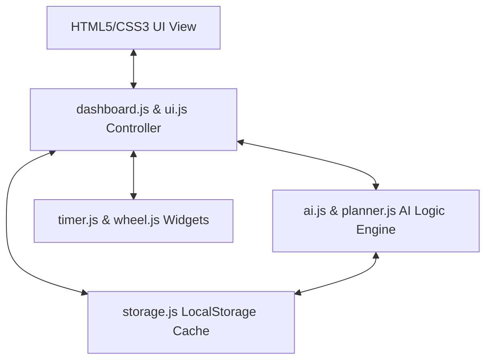

# Planora AI Study Planner - Pitch Deck & Presentation Guide

This document provides a highly detailed, slide-by-slide presentation guide to pitch **Planora AI** to evaluators, investors, or professors. It highlights the core value proposition, advanced design aesthetics, key features, technical architecture, and speaker talking points.

---

```carousel
# Slide 1: Title & Hook
### Planora AI: Level Up Your Study Habits
* **Presenter:** Your Name / Scholar
* **Subtitle:** An AI-powered, gamified productivity hub for modern learners.
* **Theme:** Glassmorphism UI with gradient glows (violet/pink/teal).
<!-- slide -->
# Slide 4: AI Planner Algorithm
### Client-Side Schedule Computing
* **Weighted Intensity:** Dynamic allocation of hours based on chapter size & difficulty score.
* **Spaced Repetition:** Dedicated final 20% timeline automatically reserved for revision.
* **Peak Focus Windows:** Automatically selects slot types (Deep Focus, Concepts, Review) based on time-of-day.
<!-- slide -->
# Slide 5: The Analytics Engine
### High-Density Academic Analytics
* **Consistency Heatmap:** 30-day productivity activity grid.
* **Trend Tracker:** Weekly study hours bar charts.
* **Balance Shield:** Subject-level time distribution tracker.
```

---

## 🎨 Presentation Theme and Design Aesthetics
* **Color Palette:** Sleek Dark Mode (Base `#0f0f12`, Glassmorphism `#1a1a24` with background blur) combined with curated, high-end gradients (Neon Teal, Radiant Pink, Electric Violet, Soft Amber).
* **Typography:** Clean sans-serif pairings like **Plus Jakarta Sans** (headings) and **Inter** (body) for a highly premium, modern interface feel.
* **Atmosphere:** State-of-the-art, digital-forward, responsive, and gamified.

---

## Slide 1: Title & Cover Slide
> **"Level Up Your Learning with Artificial Intelligence"**

### 🖼️ Visual Layout
* A centered, elegant dark glassmorphism mockup card displaying the Planora logo.
* A vibrant neon background gradient glow (pink/violet/teal).
* **Sub-text:** *An AI-Powered, Gamified Productivity Hub for Modern Learners.*
* **Footer:** Presenter Name, Title, and Date.

### 📝 Key Content
* **Planora AI**
* The next-generation cognitive assistant for automated study scheduling, productivity analytics, and active recall.
* *Developed using Vanilla HTML5, CSS3, ES6 JavaScript, and Local Session Persistence.*

### 🗣️ Speaker Notes
> "Good morning/afternoon everyone. Today, I am thrilled to present **Planora**, an AI-powered study planner designed to solve one of the greatest challenges students face today: cognitive fatigue and ineffective time management. Instead of simple calendars or static to-do lists, Planora acts as an interactive, intelligent study coach that actively adapts to your personal schedule, gamifies your study habits, and helps you achieve deep focus."

---

## Slide 2: The Problem
> **"The Modern Student Burnout Crisis"**

### 🖼️ Visual Layout
* A split-screen design.
* **Left side:** Three striking stat callouts or low-contrast cards outlining academic struggles (e.g., "75% of students struggle with procrastination," "Cramming results in 80% memory loss in 48 hours").
* **Right side:** A visual diagram of "Traditional Planner Pitfalls" (Manual setup, static deadlines, zero engagement, no personalized study tips).

### 📝 Key Content
* **The Procrastination Loop:** Passive reading and cramming lead to poor retention and high anxiety.
* **Workload Imbalance:** Students struggle to schedule multiple subjects with varying exam dates and difficulties.
* **Lack of Motivation:** Conventional digital calendars feel clinical, rigid, and offer no psychological rewards.
* **Unstructured Study Sessions:** Lack of built-in focus techniques (like Pomodoro) or active recall practices.

### 🗣️ Speaker Notes
> "Let's talk about the problem. Students are overwhelmed. Traditional planners are passive—they require manual configuration and offer no intelligent help. When exams approach, students resort to high-stress cramming. Cognitive science shows that passive reading leads to an 80% loss in memory within two days. Additionally, traditional calendars are boring; they don't motivate or reward students, leading to procrastination and burnout. That is why we built Planora."

---

## Slide 3: The Solution (Introducing Planora)
> **"Intelligent, Gamified, and Adaptive"**

### 🖼️ Visual Layout
* A central, high-resolution mockup of the Planora dashboard highlighting the 4-row desktop grid.
* Radiant glowing highlight borders highlighting:
  1. **🤖 AI Study Planner & Assistant**
  2. **📅 Spaced Repetition Calendar**
  3. **⚡ Pomodoro Timer & Spin Wheel**
  4. **📊 Analytics Tab Grid**

### 📝 Key Content
* **AI-Driven Scheduling:** Generates custom daily schedules based on exam dates, difficulty levels, and study time availability.
* **Gamified Ecosystem:** Converts studying into an RPG (Role-Playing Game) using XP, Levels, daily quests, and streak rewards.
* **Active Learning Tools:** Integrated customized Pomodoro timers, spaced-repetition revision schedules, and decision engines like the Spin Wheel.
* **Omnipresent AI Coach:** A floating conversational AI assistant capable of instant concept explanation, quiz generation, and note summarization.

### 🗣️ Speaker Notes
> "Planora is the ultimate solution. It is a structured, highly dynamic dashboard that acts as a central hub for learning. It leverages intelligent client-side algorithms to auto-calculate required study hours, schedules spaced-repetition sessions, and introduces a rich gamification layer to reward students. By logging focus hours, students earn Experience Points (XP), level up their profile, maintain daily study streaks, and unlock achievements."

---

## Slide 4: Under the Hood: The AI Study Planner
> **"How the Scheduling Algorithm Works"**

### 🖼️ Visual Layout
* A clean system architecture diagram or flowchart showing how user input turns into a study plan.
* **Visual Checklist:** Subject Select ➡️ Exam Date ➡️ Syllabus Chapters ➡️ Difficulty Level ➡️ AI Generation.
* A code snippet showing the math behind total study hours calculation and session breakdown.

### 📝 Key Content
* **Input-to-Schedule Logic:**
  * **Days Left** calculated dynamically (`examDate` minus `currentDate`).
  * **Difficulty Multipliers:** Easy ($\times 1.0$), Medium ($\times 2.5$), Hard ($\times 4.0$) mapped to syllabus size to derive `totalHoursNeeded`.
  * **Weighted Intensity:** If exams are within 7 days, daily study weight is increased by 30% for intensive revision.
* **Automated Revision Schedules:** Builds a customized spaced-repetition revision phase (`revisionDays` = 20% of total days) focusing on Mock Tests, previous papers, and summary notes.
* **Circadian Peak Window Selection:** AI Suggests peak focus hours based on the time of day (e.g., Morning for Peak Focus, Evening for Revision).

### 🗣️ Speaker Notes
> "Let's take a look under the hood at the core algorithmic logic in `ai.js` and `planner.js`. When a student inputs a subject with its exam date, syllabus size, and difficulty, Planora runs a client-side algorithm. It calculates the exact number of hours needed using difficulty multipliers and dynamically distributes these hours across the remaining days. If an exam is less than two weeks away, it triggers an 'intensive revision' mode. Furthermore, it automatically designates the final 20% of the timeline to spaced repetition, suggesting active recall drills and mock exams."

---

## Slide 5: High-Density Analytics & Heatmaps
> **"Visualizing Academic Growth"**

### 🖼️ Visual Layout
* A dual-card presentation showcasing the interactive tab panels in the dashboard.
* **Left card:** ApexCharts examples (e.g., Weekly study hours bar chart, Subject distribution pie chart).
* **Right card:** A simulated 30-day grid representing the **Productivity Heatmap**, showing gradient changes based on daily focus minutes.

### 📝 Key Content
* **Performance Overview:** Standard metrics like total tasks, pending list, completed items, and streak counts.
* **Deep Analytics Tab:**
  * **Weekly Study Hours:** Tracks time spent studying each day to identify trend cycles.
  * **Subject Distribution:** Visualizes whether study time is balanced or heavily skewed towards a single topic.
  * **Productivity Heatmap:** Tracks consistency over a rolling 30-day period.
  * **Exam Timeline Countdowns:** Visual progression tracks indicating time remaining.

### 🗣️ Speaker Notes
> "In Slide 5, we highlight our deep analytics dashboard built using custom modular ApexCharts integration. Planora doesn't just store data; it visualizes progress to keep students informed. In the 'Deep Analytics' panel, students can check their weekly study trends, see their time distribution across subjects to prevent imbalance, and interact with a 30-day productivity heatmap. Seeing the tiles light up with deep colors gives students a satisfying visual representation of their hard work and consistency."

---

## Slide 6: Gamification Mechanics & "Spin the Wheel"
> **"Turning Study into Play"**

### 🖼️ Visual Layout
* A beautiful graphic showing the gamification loop.
* An interactive "Level 1" to "Level 2" transition graphic showing an XP Progress Bar filling up.
* A high-fidelity screenshot of the **Spin the Wheel** widget and a **Daily Quest** checklist.

### 📝 Key Content
* **XP and Leveling System:** Focus sessions earned through Pomodoro timers award Experience Points (e.g., +50 XP per completed timer).
* **Daily Quests:** Dynamic challenges (e.g., "Complete 2 pomodoros today," "Log 1 hour of Study") that refresh daily to form positive study loops.
* **Gamified Badges:** Achievements like *Consistency King* (3-day streak), *Deep Focus Master* (2 hours straight), or *Syllabus Crusher* (Completed all tasks).
* **The Spin Wheel:** A gamified decision helper built with HTML5 Canvas. If a student is hit with choice paralysis, they spin the wheel to select their next study session with satisfying retro click sounds.

### 🗣️ Speaker Notes
> "One of our most popular additions is the Gamification panel. Planora addresses the psychological friction of starting a study session by treating it like an RPG. Completing Pomodoro sessions or ticking off subjects awards Experience Points, which increases the user's level badge. We have also built a custom HTML5 Canvas-based 'Spin the Wheel' widget. When students suffer from decision fatigue and don't know what to study next, they can spin the wheel to select a subject, adding fun and gamified interaction to their dashboard."

---

## Slide 7: The Conversational AI Assistant
> **"A Personalized Tutor in Your Pocket"**

### 🖼️ Visual Layout
* A mobile chat mockup showcasing the floating **Planora AI** chat interface.
* Dialogue bubbles showing typical interactions:
  * **Student:** *"Explain spaced repetition"*
  * **AI:** *"Spaced repetition is..." [Detailed Concept Breakdown + Application Tips]*
  * **AI:** *[Interactive Options: "Explain Active Recall", "Quiz Me", "Start Pomodoro"]*

### 📝 Key Content
* **Intent Detection Engine:** Processes student queries dynamically to route to specialized handlers (Explain, Quiz, Summarize, Notes, Motivation, Pomodoro, Progress).
* **Instant Academic Explanations:** Contains pre-loaded expert guides for key memory techniques like the Cornell Method, Feynman Technique, and Memory Palace.
* **Interactive Chat Quizzes:** Dynamically pulls questions, displays interactive multiple-choice buttons in-chat, checks answers, and awards XP (+50 XP) for correct answers.
* **Burnout & Imbalance Alerts:** Analyzes local storage data to suggest when to take a break or warn if a specific subject is being neglected.

### 🗣️ Speaker Notes
> "Planora's most powerful feature is its omnipresent AI Chat Assistant. By combining modular JavaScript handlers, it detects student intent on the fly. It can act as a personal academic tutor—explaining complex concepts using built-in study sciences like the Feynman Technique or spaced repetition. It can also instantly launch a multiple-choice quiz directly within the chat bubble, checking answers in real-time, giving immediate helpful explanations, and rewarding correct answers with XP. It is an end-to-end active learning mechanism."

---

## Slide 7b: Distraction Buster & Focus Reboot
> **"Scientific Tools to Beat Academic Procrastination"**

### 🖼️ Visual Layout
* A split layout showing:
  * **Left:** The glassmorphism picker panel displaying the 4 distraction channels (Phone, Sleepy, Loud Noise, Brain Fog).
  * **Right:** A step-by-step visual guide of the **1-Minute Box Breathing Circle** shrinking and growing.
* Inset highlighting the "⚠️ Stepped away for 15 seconds?" visibility auto-detector.

### 📝 Key Content
* **Dynamic Distraction Diagnostics:** Immediate, category-specific cognitive tips for the student's exact distraction source.
* **1-Minute Focus Breathing Circle:** An animated Box Breathing visual tool (Inhale, Hold, Exhale, Hold) to immediately reduce anxiety and restore calm.
* **Physical & Muscle Reset:** A built-in physical stretch guide to restore attention loops.
* **Proactive Focus Detection:** Integrated Page Visibility API auto-detects when students leave the tab during active Pomodoro sessions, pausing timers to prevent lost tracking and warmly nudges them to refocus on return.

### 🗣️ Speaker Notes
> "To complement our active learning tools, we built a custom 'Distraction Buster & Focus Reboot' engine. Rather than scolding students for losing attention, Planora uses positive cognitive science. A student can click 'Distracted? 🧠' at any time during active study to open a dedicated reboot panel. It provides specific, instant advice based on their block—like digital phone solutions, fatigue physical resets, or white-noise tips. We even integrated a live interactive box-breathing cycle widget that expands and contracts, guiding students to lower anxiety and restore focus. Furthermore, if a student switches tabs, Planora auto-detects they stepped away, pauses the timer, and offers this recovery guide when they return."

---

## Slide 8: Technical Architecture & Stack
> **"Lightweight, Fast, and Secure Client-Side Engine"**

### 🖼️ Visual Layout
* A clean system architecture diagram or directory layout showing how the decoupled JS files interact.
* Icons representing **HTML5/CSS3**, **Vanilla JS ES6**, and **Local Storage**.



### 📝 Key Content
* **Front-End Architecture:** Structured using standard HTML5 semantic tags, styled with vanilla, high-performance CSS animations (no heavy Tailwind dependencies).
* **Decoupled JavaScript Controllers:**
  * `auth.js` for lightweight session persistence.
  * `storage.js` for centralized task and progress storage.
  * `ai.js` + `planner.js` for client-side schedule computing.
  * `timer.js` + `wheel.js` + `depth.js` for visual features.
* **Data Security & Privacy:** Zero-latency operations as all study patterns, logs, and profiles are cached locally on the user's device.

### 🗣️ Speaker Notes
> "Let's review the technical details of the application. Planora is engineered to be extremely lightweight, highly responsive, and completely private. We utilize a highly decoupled client-side architecture written in pure Vanilla ES6 JavaScript, which interacts directly with the browser's Local Storage cache. There is zero database lag, and student privacy is maintained because all data remains on the user's local machine. The layout is fully responsive, leveraging advanced modern CSS3 transitions and keyframe animations for a fluid, premium desktop and mobile experience."

---

## Slide 9: User Experience & Design Language
> **"Visual Excellence in Action"**

### 🖼️ Visual Layout
* Side-by-side comparative mockup of **Light Mode** vs. **Dark Mode** layouts.
* Highlight of the glassmorphism properties (backdrop blur, semi-transparent border, drop shadow).
* Micro-interaction highlights: hover effects on cards, pulse glow buttons, XP bar transitions.

### 📝 Key Content
* **Dynamic CSS Architecture:** Optimized design systems using custom CSS variables for effortless theme switching (dark/light modes).
* **Consistent Hierarchy:** Structured grid spacing designed to prevent cognitive clutter.
* **Accessibility & readability:** High-contrast fonts, clean HSL priority indicators (Red = Urgent, Amber = Medium, Teal = Low).
* **Micro-Animations:** Immersive slide-ups, fade-ins, and glow states that react seamlessly as the user interacts.

### 🗣️ Speaker Notes
> "In Slide 9, we focus on the user experience and UI design. We believe that a beautiful, premium design keeps users coming back. Planora features a beautiful default Dark Mode, featuring glassmorphism elements, custom backdrop-filters, and soft gradient glows that represent modern tech interfaces. We've also meticulously calibrated a Light Mode that resolves previous color inconsistencies, ensuring readable contrast across both themes. Micro-interactions like hover rises, active state glows, and smooth XP progress fills make the application feel alive and premium."

---

## Slide 10: Roadmap & Future Vision
> **"Scaling Planora AI"**

### 🖼️ Visual Layout
* A horizontal timeline graphic (e.g., Phase 1, Phase 2, Phase 3).
* Short text boxes representing future technological expansions.

### 📝 Key Content
* **Phase 1: Real-Time Sync & Cloud DB Integration** (Transition from Local Storage to a secure MongoDB/PostgreSQL back-end).
* **Phase 2: PDF & Media Learning parsing** (Allowing users to upload study materials, notes, or lecture PDFs, which the AI automatically parses into dynamic task lists and flashcard quizzes).
* **Phase 3: Peer-to-Peer Social Gamification** (Introducing multiplayer study groups, shared study rooms, and regional leaderboards to further boost user accountability).
* **Phase 4: Calendar Integrations** (Bidirectional calendar synchronization with Google Calendar, Outlook, and Apple Calendar).

### 🗣️ Speaker Notes
> "Looking ahead, we have a clear vision for the evolution of Planora. While our client-side storage provides incredible speed and privacy, our next phase will introduce cloud synchronization for cross-device access. We also plan to integrate an AI-powered PDF compiler, allowing students to drag and drop textbook chapters to automatically generate schedules and custom quizzes. Finally, we want to expand the gamification layer to include multiplayer classrooms where students can join focus lobbies and compete on leaderboard quests together."

---

## Slide 11: Conclusion & Q&A
> **"Planora AI: Study Smarter, Level Up Faster."**

### 🖼️ Visual Layout
* A gorgeous high-contrast dark theme splash slide showing the tagline.
* Contact info, GitHub repository URL, and app URL.
* A prominent **"Thank You / Questions?"** callout card.

### 📝 Key Content
* **Planora AI**
* Empowering students with intelligent planning, automated micro-routines, deep data analytics, and rich gamification.
* *Questions or Live Demo requests?*
* **Contact:** `your.email@domain.com` | **GitHub:** `github.com/username/planora`

### 🗣️ Speaker Notes
> "In conclusion, Planora is more than just a typical task list—it is an intelligent, gamified learning companion designed for the modern age. It takes the stress out of planning, rewards consistency, and helps students achieve academic success without burnout. Thank you so much for your time today. I would love to open the floor to any questions you may have, or I can walk you through a live interactive demo of the application. Thank you."
